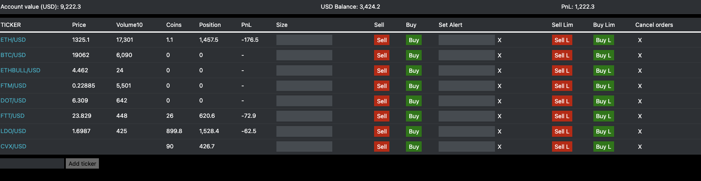
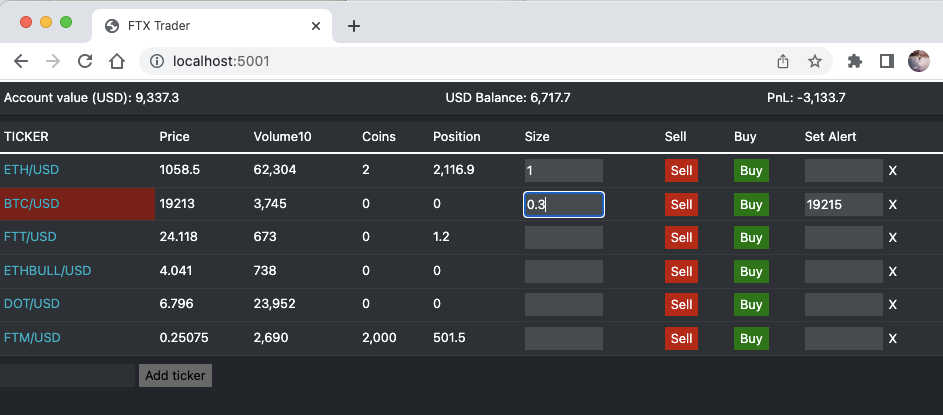
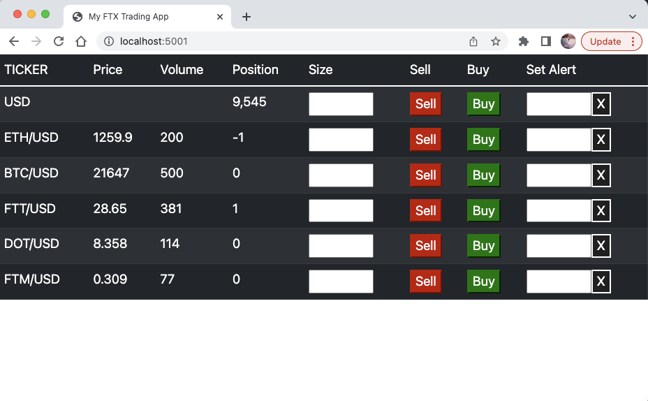

# FTX Trader

A fast, minimalist front end for trading cryptos on the FTX Exchange.


(_version 1.2 screenshot_)

## Background

The FTX Exchange is a great venue for trading all kinds of crypto assets and derivatives.  However, the FTX web interface is quite
un-user friendly and unadapted to day trading workflow.  For example it lacks a unified view of assets from which orders can be quickly 
open and closed and setting up new orders is fiddly.  It is also difficult to monitor coin positions and pnl in realtime and there is 
no price alert functionality. 

All this ultimately gets in the way of the trading workflow and decision making.

This project aims to fix some of those issues by providing an alternative front end which focuses on fast order placement and management, 
intuitive real time position monitoring and quick price alerting functionalities, all in one view.


## How to install

### 1. Clone the project and run `npm install` (this will to download the libraries defined in FTXTrader/package.json):

```
git clone https://github.com/jule64/FTXTrader.git
cd FTXTrader
npm install
```

### 2. Create a `apikeys.json` file in the `./apikeys` folder and add your FTX api keys to it:

```
cd ./apikeys
touch apikeys.json
```

Api keys format:
```
{
  "key": "your-ftx-public-key",
  "secret": "your-ftx-secret-key"
}
```
Save the file and you are ready to start the app.

### 3. Start the app:

```
node App.js
```

Once started head over to `http://localhost:5001/` on your browser to access the app.

### 4. Account balances (Optional):

If you want your account balance correctly displayed in the app you need to add your balance in the `appData.json` file against the `totalFunding` variable:

`./resources/appData.json`

Note the `totalFunding` variable is zero by default: `"totalFunding": 0`


## Tech stack
The app runs on Nodejs with a light weight html front end.
It uses [tiagosiebler](https://github.com/tiagosiebler)'s [FTX Api](https://github.com/tiagosiebler/ftx-api) library
for the the realtime prices and account operations with the FTX Exchange.

The client-backend communication is done over `socket.io`


## Disclaimer
This app is own my personal project and is not affiliated with the FTX Exchange.
 
I use it for my own trading **BUT I make no guaranty as to it's safety for YOUR trading!**  

Note also that this code is constantly changing and can be buggy! So if you are considering using this app for your own trading
make sure you first understand the code and the risks before attempting any trading with it.

Note a read-only version of the app will be available soon for those wishing to try that first.

## App Timeline & Features

### 25 Sep 22 / v1.2 - Added Limit orders and some bug fixes


### 26 June 22 / v1.1 - Improvements on version 1  
- cleaner Front end with a FTX-like color theme
- added account balances section at the top of the app
- flashing alerts: as well as the sound effect from v1 now the ticker cells flash red or green on alerts  
- intelligent alerting: The alerts automatically stop flashing and stop play sound when the price crosses the alert threshold
back in the non-alert price zone
- single position balance updates: update a given position immediately after order is successfully executed
- added a Coins column in main table to display positions in coins next to usd-equivalent positions
- new "Add ticker" input box: add a new ticker to the main table.  note the tickers are not yet persistent so they disappear
from the main table on app restart (persistence to be added in next version of the app)

 

(_v1.1 screenshot_)

### 15 June 22 / v1.0 - First working version  
- display real time prices and volumes from the exchange
- place market orders
- position display
- alert setup with sound effects



(_v1 screenshot_)


