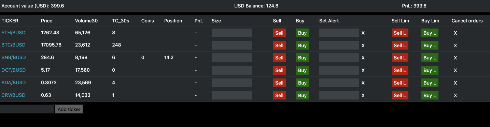
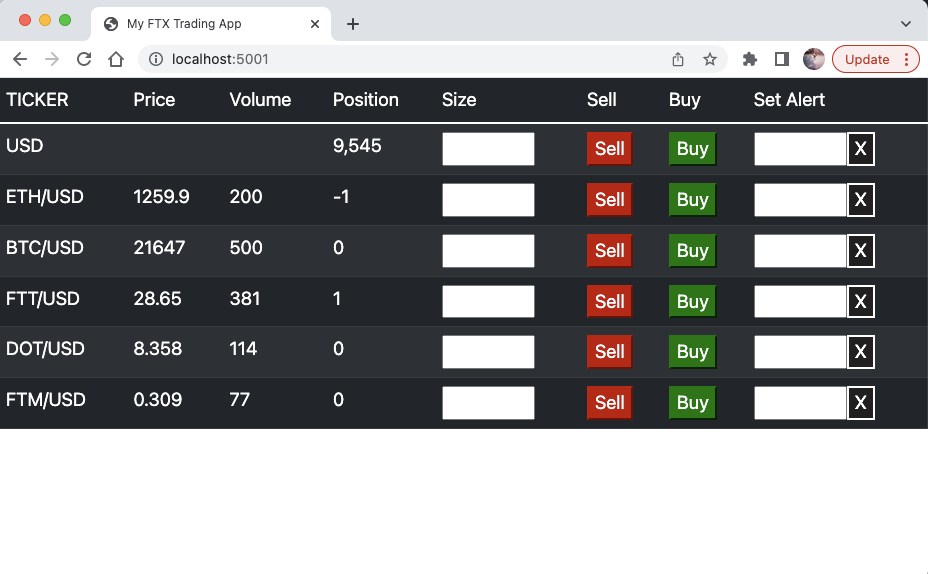

# Binance Trader

A fast and minimalist web frontend to trade cryptos on Binance®


(_version 1.0_)

## Introduction

[Binance](https://www.binance.com/en) is a great crypto exchange with one of the largest selection of crypto assets to buy and sell.

However, if you use the site on a regular basis you might notice that their web interface is quite cluncky and slow to use. For example, there is no easy way to display and see live prices of all your favorite cryptos in one view. In addition, buying and selling is slow and cumbersome as you have to open each asset in dedicated windows and enter your trade inputs each time. There is also no price alert functionality so you cannot closely monitor specific price changes such as breakouts/resistance changes.

All this ultimately gets in the way of the trading workflow and the ability to react and make fast decisions.

This project aims to fix those issues by providing an alternative trading UI which focuses on fast order placement, real time position monitoring and quick price alerting functionalities - all in one view.


## Project history

I originally built this app to trade on the FTX exchange. However, with the exchange going ☠️ in November 2022 I decided to adapt the code to trade on Binance.

This app therefore has the same look and feel and most of the functionalities of the original FTX app and I am adding new features and improvements on a regular basis.

Installation steps and info about the project detailed in sections below. 

Contributions: if you are interested in contributing have a look at the features and bugs listed [here](https://github.com/jule64/BinanceTrader/issues) or feel free to raise a new issue :)


# Installation

## !! WARNINGS !!

This app places LIVE trading orders, use it at your own risk!

I do use this app for my own trading however I make **NO GUARANTY as to it's safety for YOUR trading and YOUR FUNDS!** Therefore, if you are considering using this app for your own trading please make sure you understand the code and the risks before attempting to use it.

Also this app is my own personal project and it is not affiliated with Binance whatsoever. 

### 1. Pre-requisites

**You will you need your own Binance account and API keys in order to run this app.** Check Binance's [website](https://www.binance.com/en) if you don't have those.

### 2. Clone the project and run `npm install` (this will to download the libraries defined in BinanceTrader/package.json):

```
git clone https://github.com/jule64/BinanceTrader.git
cd BinanceTrader
npm install
```

### 3. Compile the Typescript project:

```
npm run tsc
```


### 4. Start the app:

```
APIKEY=your-api-key APISECRET=your-api-secret APP_PORT=5001 node App.js
```

Once started head over to `http://localhost:5001/` on your browser to access the app.

### 5. Account balances (Optional):

If you want your account balances to display correctly in the app you need to update the `totalFunding` variable in the `appData.json` file to your account cash value (note it is zero by default: `"totalFunding": 0`)


## Tech stack

This app is built with Typescript, Nodejs and Express.js with a light weight html front end.
It uses [tiagosiebler](https://github.com/tiagosiebler)'s [Binance connectors](https://github.com/tiagosiebler/binance)
to get real time prices from Binance and submit trading orders to the exchange.
It uses `socket.io` for the  communication between the web UI and nodejs backend. 


## App Timeline & Features

### 9 July 2023 - Bug fixes and allow price alerts to be persisted & reused between sessions


### 11 Dec 2022 / v1.0 - First Binance-ready version following revamp from the old FTX App.

- Contains all the features that existed with the original FTX App except the Pnl module (to be added at a future time)
- Main features include market/limit orders placement, account and coin balances, price alerts.
- Also added volume and trade counts stats per coin (see "Volume30" and "TC_30s" columns in the UI)


### Timeline and screenshots from the original FTX APP:

### 25 Sep 22 / v1.2 - Added Limit orders and some bug fixes

### 26 June 22 / v1.1 - Improvements on version 1  
- cleaner Front end with a FTX-like color theme
- added account balances section at the top of the app
- flashing alerts: as well as the sound effect from v1 now the ticker cells flash red or green on alerts  
- intelligent alerting: The alerts automatically stop flashing and stop play sound when the price crosses the alert threshold
back in the non-alert price zone
- single position balance updates: update a given position immediately after order is successfully executed
- added a Coins column in main table to display positions in coins next to usd-equivalent positions
- new "Add ticker" input box: add a new ticker to the main table.  note the tickers are not yet persistent so they disappear
from the main table on app restart (persistence to be added in next version of the app)

 

(_v1.1 screenshot_)

### 15 June 22 / v1.0 - First working version  
- display real time prices and volumes from the exchange
- place market orders
- position display
- alert setup with sound effects



(_v1 screenshot_)


