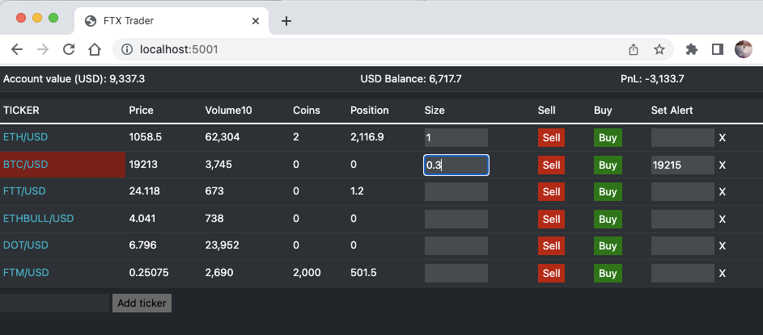

# FTX Trader

A fast, minimalist front end for trading cryptos on the FTX Exchange.




## Background

The FTX Exchange is a great venue for trading all kinds of cryptos and derivative contracts.  However the FTX web frontend is not
very well adapted to the rapid-fire, action-first type of trading that some traders are looking for.  In particular 
the order booking system is a bit clunky to use and requires too many manual steps to set up new orders and manage pending orders which ultimately
slows down the trading worflow. It is also not very good for monitoring positions and pnl in realtime and there is no price alert functionality. 

This app aims to fix some of those issues by providing an alternative front end which focuses on fast order placement,
easy order management and intuitive position monitoring and alerting.


## How to install
After cloning this project simply run npm install and run the main file:
```
npm install
node FTXTrading.js
```

## Tech stack
The app runs on Nodejs with a light weight html front end and bootstrap css.
We use [tiagosiebler](https://github.com/tiagosiebler)'s [FTX Api](https://github.com/tiagosiebler/ftx-api) library
for all the realtime prices and rest operations with the FTX Exchange.


## Disclaimer
This app is my personal project and is NOT affiliated to the FTX Exchange.  I use it for my own trading but also for 
experimenting with nodejs developement and explore trading ideas. It is constantly evolving and **I make no guaranty as to it's safety for realtime trading!**  
Therefore if you are considering using this app to trade I highly recommend first familiarising yourself with the code before 
attempting any trading with it!


## App Timeline & Features

### 26 June 22 / v1.1 - Improvements on version 1  
- cleaner Front end with a FTX-like color theme
- added account balances section at the top of the app
- flashing alerts: as well as the sound effect from v1 now the ticker cells flash red or green on alerts  
- intelligent alerting: The alerts automatically stop flashing and stop play sound when the price crosses the alert threshold
back in the non-alert price zone
- single position balance updates: update a given position immediately after order is successfully executed
- added a Coins column in main table to display positions in coins next to usd-equivalent positions
- new "Add ticker" input box: add a new ticker to the main table.  note the tickers are not yet persistent so they disappear
from the main table on app restart (persistence to be added in next version of the app)


### 15 June 22 / v1.0 - First working version  
- display real time prices and volumes from the exchange
- place market orders
- position display
- alert setup with sound effects


_screenshot: v1.0_


