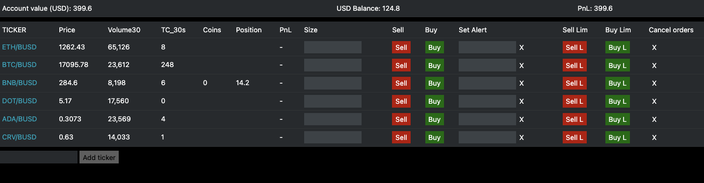
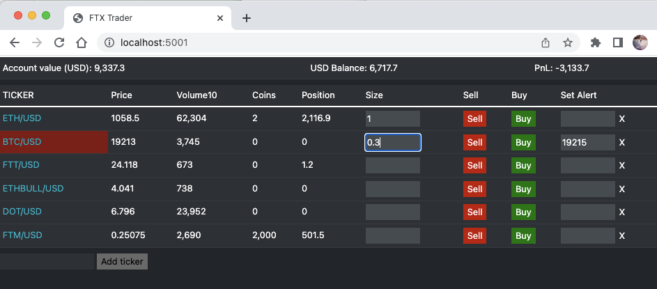
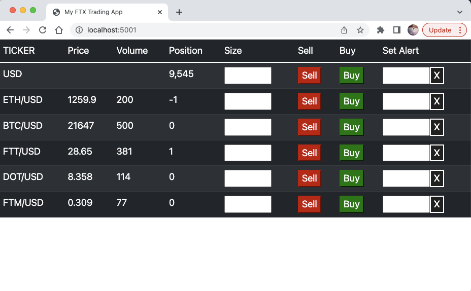

# Binance Trader

A fast, minimalist web frontend for trading cryptocurrencies on Binance®


(_version 1.0_)

## Introduction

[Binance](https://www.binance.com/en) is one of the largest cryptocurrency exchanges, offering a wide selection of assets to trade.

However, frequent users of the Binance web interface may find it slow and cumbersome. For example:

- There is no simple way to view live prices for all your favorite assets in a single, unified view.
- Buying and selling requires navigating through multiple pages and re-entering trade parameters each time.
- There is no built-in price alert system, making it difficult to monitor breakouts or key resistance/support levels in real time.

All of this interrupts the trading workflow and slows down decision-making.

**Binance Trader** addresses these issues by providing an alternative trading UI focused on:
- Fast order placement  
- Real-time position monitoring  
- Quick and configurable price alerts  

—all accessible from a single screen.


# Installation

## Important Notes

This application is capable of placing **live trading orders** when used with trading-enabled Binance API keys.

If you want to explore or test the app safely, you can start with **read-only Binance API keys**. In this mode, the app will be able to:
- Fetch real-time market prices
- Display account balances and positions

…but it will **not** be able to place orders.

This project is a personal side project and is **not affiliated with Binance**.

---

## 1. Prerequisites

You will need:
- A Binance account
- Minimum read-only Binance API keys

You can create API keys from your Binance account dashboard.

See the [Binance website](https://www.binance.com/en) for details.

---

## 2. Clone the Project and Install Dependencies

```bash
git clone https://github.com/jule64/BinanceTrader.git
cd BinanceTrader
npm install
```

## 3. Compile the Typescript project:

```bash
npm run tsc
```


## 4. Start the app:

```bash
APIKEY=your-api-key APISECRET=your-api-secret APP_PORT=5001 READ_ONLY=true node App.js
```

Or using npm scripts:

```bash
# Read-only mode (market data only, no order placement)
npm run start:readonly

# Full trading mode
npm start
```

note: the npm script requires the following env vars set in your shell:

| Variable | Used by      |
|---|--------------|
| `BINANCE_READONLY_APIKEY` | `start:readonly` |
| `BINANCE_READONLY_API_SECRET` | `start:readonly` |
| `BINANCE_APIKEY` | `start`      |
| `BINANCE_API_SECRET` | `start`      |
| `APP_PORT` | example 5001 |


Once started head over to `http://localhost:5001/` on your browser to access the app.

## 5. PnL balance:

The PnL value displayed in the top right corner of the app requires setting the  `totalFunding` variable in `appData.json` to match your account’s total cash value.
This variable is set to 0 by default so your PnL will not be correct until you set the value to match the amount of funding of your account.

## Tech Stack

- **TypeScript**
- **Node.js**
- **Express.js**
- Lightweight HTML frontend
- **socket.io** for real-time communication between the web UI and Node.js backend
- [tiagosiebler’s Binance connectors](https://github.com/tiagosiebler/binance) for:
  - Real-time market data
  - Submitting trading orders to Binance
  - (Supports both mainnet and testnet environments)

---


## App Timeline & Features

### 1 Jan 2026
- display trade volumes and 24hour price changes


### 9 July 2023
- Bug fixes
- Price alerts persisted and reused across sessions

### 11 Dec 2022 — v1.0 (First Binance Version)
- All original features from the FTX app except the PnL module (planned for a future release)
- Main features:
  - Market and limit order placement
  - Account and coin balance display
  - Price alerts
  - Volume and trade count statistics per coin  
    (see `Volume30` and `TC_30s` columns in the UI)

---

## Original FTX App Timeline & Screenshots

### 25 Sep 2022 — v1.2
- Added limit orders
- Bug fixes

### 26 June 2022 — v1.1
- Improved frontend with an FTX-style color theme
- Account balances displayed at the top of the app
- Visual flashing alerts (red/green) in addition to sound alerts
- Intelligent alerting:
  - Alerts automatically stop when the price re-enters the non-alert range
- Immediate position updates after successful order execution
- Added a **Coins** column to display coin balances alongside USD-equivalent values
- Added an **Add ticker** input to dynamically add symbols  
  *(Note: tickers were not yet persistent and reset on app restart)*

  
(_v1.1 screenshot_)

### 15 June 2022 — v1.0
- First working version
- Real-time price and volume display
- Market order placement
- Position tracking
- Price alerts with sound notifications

  
(_v1 screenshot_)


