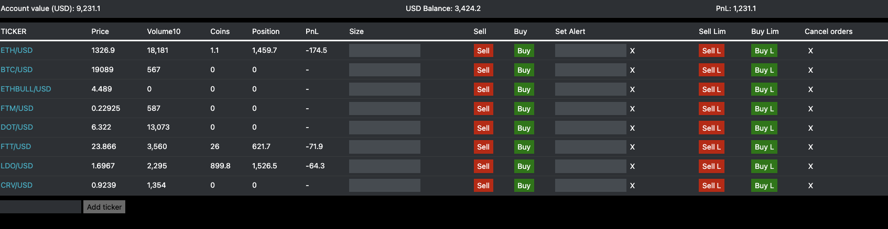

# Binance Trader

A fast, minimalist front end for trading cryptos on the Binance Exchange.


(_version 1.2 screenshot_)


# Installation

## Note this is the code for the DEMO app  
This version provides real time price updates and price alert functionalities. This is the recommended version to use for those wishing to try the app without needing order placement functionalities.

Note you will need a Binance API key to use this app.

## How to install

### 1. Clone the project, checkout the `demo` branch and run `npm install`:

```
git clone https://github.com/jule64/BinanceTrader.git
cd BinanceTrader
git checkout -b demo origin/demo
npm install
```


### 3. Start the app:

```
APIKEY="" APISECRET="" node App.js
```

Once started head over to `http://localhost:5001/` on your browser to access the app.
