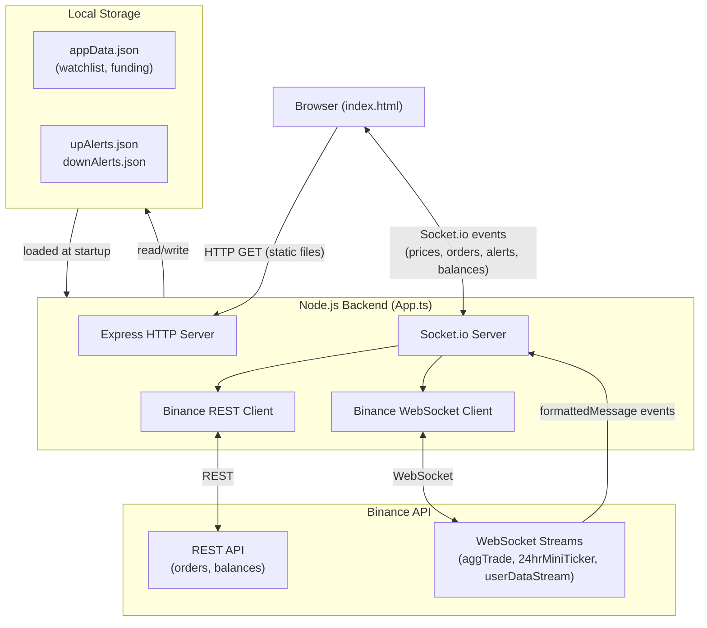

# Architecture

```mermaid
graph TD
    Browser["Browser (index.html)"]

    subgraph Backend ["Node.js Backend (App.ts)"]
        Express["Express HTTP Server"]
        SIO["Socket.io Server"]
        RC["Binance REST Client"]
        WS["Binance WebSocket Client"]
    end

    subgraph Binance ["Binance API"]
        BREST["REST API\n(orders, balances)"]
        BWS["WebSocket Streams\n(aggTrade, 24hrMiniTicker, userDataStream)"]
    end

    subgraph Storage ["Local Storage"]
        AppData["appData.json\n(watchlist, funding)"]
        Alerts["upAlerts.json\ndownAlerts.json"]
    end

    Browser -->|"HTTP GET (static files)"| Express
    Browser <-->|"Socket.io events\n(prices, orders, alerts, balances)"| SIO

    SIO --> RC
    SIO --> WS
    RC <-->|"REST"| BREST
    WS <-->|"WebSocket"| BWS

    BWS -->|"formattedMessage events"| SIO

    Backend -->|"read/write"| Storage
    Storage -->|"loaded at startup"| Backend
```
